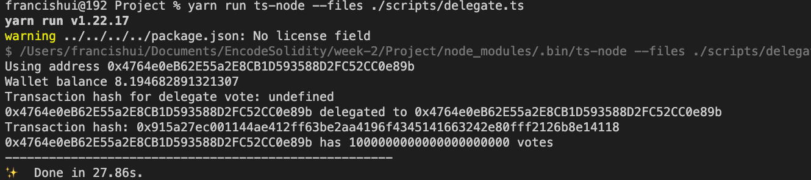
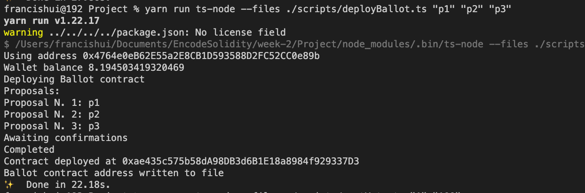
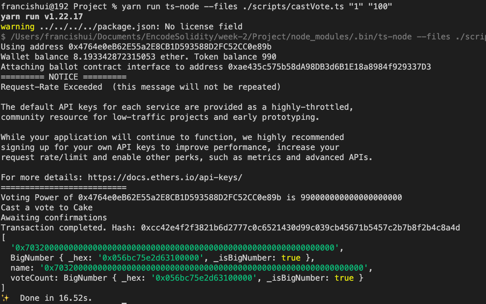
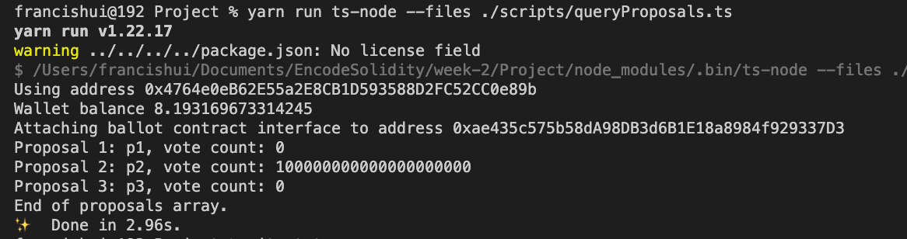

# Week 2 Project - Group 16

Structure scripts to
* Deploy everything
* Interact with the ballot factory
* Query proposals for each ballot
* Operate scripts
Run the scripts with a few set of proposals, play around with token balances, cast and delegate votes, create ballots from snapshots, interact with the ballots and inspect results

Note: Add .env file with your private key details before running the script

<hr />

### Deploy Token contract

* Token contract address: ``0x2b5EFb14004036e57e0E4C7917F6E060D9A5F476``
* Transaction hash: ``0x772394fb1a654b8acb50088be2dbee579844bee68232cebff71dde746ca99a61``
```
yarn run ts-node --file ./scripts/deployToken.ts

```

<hr />

### Delegate voting power to own address

* Token contract address: ``0x2b5EFb14004036e57e0E4C7917F6E060D9A5F476``
* Delegate voting power to own address via ``delegate`` function
* Wallet address: ``0x4764e0eB62E55a2E8CB1D593588D2FC52CC0e89b`` 
* Transfer 10 token to another address (``0xb2cddF705eA6f12D7B5Da081F679305A3209Af99``) via ``transfer`` function, thus reducing voting power of own address
* With transfer of token, voting power is reduced via ``_afterTokenTransfer`` hook which executes ``_moveVotingPower``
* Transaction hash for delegating: ``0x416756e85284ba73c19a1623e45840c58f5bc37f0f41df1964d3f6d3378eb5d8``
```
yarn run ts-node --file ./scripts/delegate.ts

```



<hr />

### Deploy Ballot contract

* Token contract address: ``0x2b5EFb14004036e57e0E4C7917F6E060D9A5F476``
* Ballot contract address: ``0xae435c575b58dA98DB3d6B1E18a8984f929337D3``
* Deploy ballot contract after delegating voting power and transfer token
* Snapshot of voting power is taken at deployment of Ballot contract, and this cannot be changed subsequently

```
yarn run ts-node --file ./scripts/deployBallot.ts "p1" "p2" "p3"

```



### Cast Vote

* Token contract address: ``0x2b5EFb14004036e57e0E4C7917F6E060D9A5F476``
* Ballot contract address: ``0xae435c575b58dA98DB3d6B1E18a8984f929337D3``
* Wallet address: ``0x4764e0eB62E55a2E8CB1D593588D2FC52CC0e89b``
* Wallet has a voting power of 990 token after transferring 10 token to another address
* Query voting power via ``votingPower`` function 
* Then cast vote via ``vote`` function in Ballot contract
* Voted for proposal 2 (index=1), 100 token is spent, thus voting power reduced by 100
* Transaction hash: ``0xcc42e4f2f3821b6d2777c0c6521430d99c039cb45671b5457c2b7b8f2b4c8a4d``

```
yarn run ts-node --file ./scripts/castVote.ts "1" "100"

```


### Query proposals and voting results

* Token contract address: ``0x2b5EFb14004036e57e0E4C7917F6E060D9A5F476``
* Ballot contract address: ``0xae435c575b58dA98DB3d6B1E18a8984f929337D3``
* Wallet address: ``0x4764e0eB62E55a2E8CB1D593588D2FC52CC0e89b``
* Get proposal names and vote count in Ballot contract by querying ``proposals``
* Convert proposal name to string using ``ethers.utils.parseBytes32String()``

```
yarn run ts-node --file ./scripts/queryProposals.ts 

```
